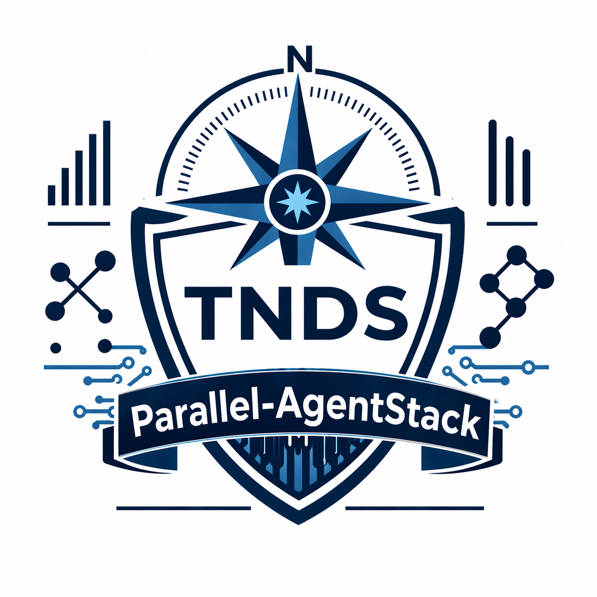

<div align="center">

# Parallel Agent Framework
### Run 2-3 AI agents on the same codebase without conflicts

[](docs/)
[](LICENSE)
[](https://truenorthstrategyops.com)



</div>

## What this is

A provider-agnostic coordination framework for running multiple AI agents (Claude, ChatGPT, Ollama, or any LLM) on the same project simultaneously. Each agent owns a track, works in declared file zones, and coordinates through a shared log. No merge conflicts, no duplicated work, no silent assumptions.

It is markdown templates, two init scripts, and a protocol. No runtime, no dependencies, no lock-in.

## What it does

- Assigns each agent a **track** (frontend, backend, devops) with declared file zones
- Enforces a **coordination log** as the single source of truth for task status, blockers, and API contracts
- Provides a **task completion protocol** so every finished task produces a record, the next prompt, and a log update
- Defines **integration checkpoints** where agents stop and verify their work connects
- Ships four **template variants**: 2-agent with zones, 3-agent with a DevOps track, coordination-only (no file rules), and a generic variant

## How it works

```
  Agent A (Frontend)           Agent B (Backend)           Agent C (DevOps, optional)
        |                            |                              |
        |-- src/components/          |-- src/api/                   |-- .github/
        |-- src/pages/               |-- src/server/                |-- tests/
        |-- src/styles/              |-- src/db/                    |-- docker/
        |                            |                              |
        +---------> AGENT_COORDINATION_LOG.md (shared) <-------------+
                         |
                         v
              Integration Checkpoint
              (stop, verify, document, continue)
```

## Quick start

```bash
git clone https://github.com/<your-username>/parallel-agent-framework.git
cd parallel-agent-framework
```

**Windows (PowerShell):**

```powershell
.\tools\init-project.ps1 -ProjectPath "C:\Users\you\Desktop\my-project"
```

**Mac / Linux:**

```bash
chmod +x tools/init-project.sh
./tools/init-project.sh ~/Desktop/my-project
```

The script creates `AI-INSTRUCTIONS.md`, `AGENT_COORDINATION_LOG.md`, and starter prompts for each agent. Paste `AI-INSTRUCTIONS.md` into each agent chat window, hand each agent its starter prompt, and go.

Full setup walkthrough: [docs/QUICKSTART.md](docs/QUICKSTART.md).
Framework deep-dive: [docs/README-AI-PARALLEL-DEVELOPMENT.md](docs/README-AI-PARALLEL-DEVELOPMENT.md).

## Project structure

```
.
├── templates/
│   ├── AI-PROJECT-TEMPLATE-PROMPT.md        # 2-agent with file zones (default)
│   ├── AI-PROJECT-TEMPLATE-3AGENT.md        # 3-agent (Frontend / Backend / DevOps)
│   ├── AI-AGENT-NO-FILE-RULES-PROMPT.md     # Coordination-only, no file rules
│   └── AI-AGENT-REFERENCE-CARD.md           # One-page cheat sheet
├── examples/
│   └── AI-AGENT-EXAMPLE-SAAS-DASHBOARD.md   # Worked example
├── docs/
│   ├── QUICKSTART.md
│   └── README-AI-PARALLEL-DEVELOPMENT.md
└── tools/
    ├── init-project.ps1                     # Windows scaffolding
    └── init-project.sh                      # Mac/Linux scaffolding
```

## Core principles

- **No silent assumptions** — if an agent needs something, it writes it in the log
- **Structured handoffs** — every completed task produces a completion record, next prompt, and log update
- **File zone ownership** — each agent has declared zones to prevent conflicts
- **Integration checkpoints** — periodic stops to verify tracks connect
- **Provider-agnostic** — works with any LLM that can follow instructions

## License

MIT — see [LICENSE](LICENSE).

## Built by

Jacob Johnston | True North Data Strategies LLC | SDVOSB
jacob@truenorthstrategyops.com
# parallel-agentstack
